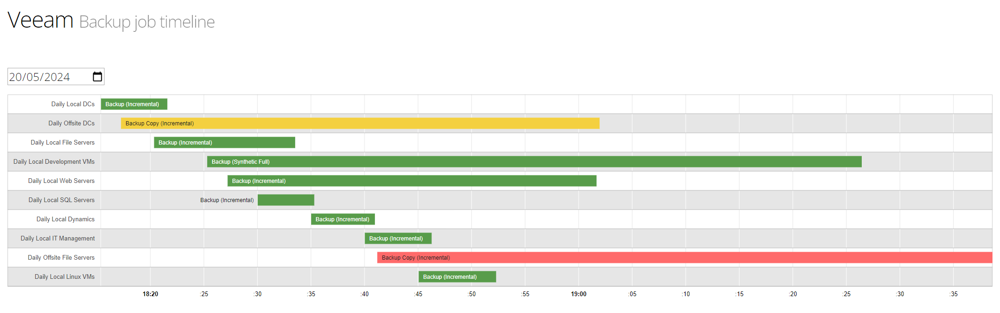

# Veeam Job Timeline View

## What?

A small static html app that displays Veeam jobs in a timeline view. 

Hovering over a job on the timeline will show job details, including any errors or warnings reported by Veeam. 

## How?

A PowerShell script exports Veeam job session data for a range of dates into JSON files. Those JSON files are used to graph the timelines using a static HTML page and Google Charts JS library.

## Deployment

The static content in `/public_html` will need to be served by a web server. 

The PowerShell script in `src` will need to be ran on the Veeam server (or can be updated to work over WinRM). 

The PowerShell script will output JSON files, the plumbing of those JSON files to the `public_html/backupdata` folder will be left to you.

## Notes

This is from a pet project from years ago. It has been updated to remove Bootstrap 3.3.7 (released in 2016, to give you an idea of the age) and jQuery. Not much else has been updated, so there is plenty of room for improvement.

Wrote a bit more about it in this [blog post](https://xkln.net/blog/timeline-visualisation-of-veeam-backup-job-sessions/)
